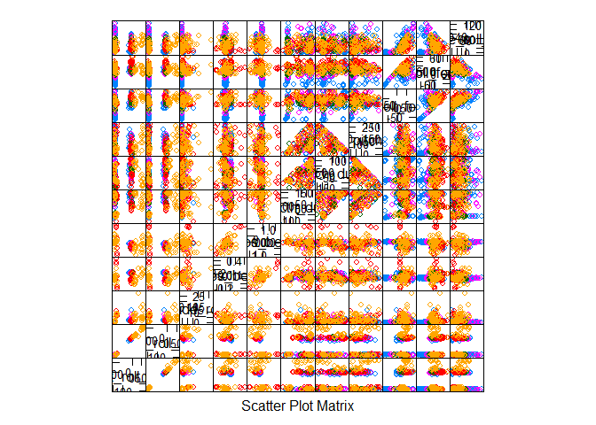

# machine learning : Peer Assessment

***

### overview and summary

We will analyze how well subjects perform a particular weight-lifting exercise by analysing data from accelerometers on the belt, forearm, arm, and dumbell of 6 participants.

The data consists of 160 measurements.

To model a predictor, I took into consideration the following analysis :

- The exercise was the biceps curl, so I tried to focus the measurements on both relative position of belt/forearm/arm/dumbbell as well as relative acceleration of same.

- I generated a number of subsets of measurements with caret's featurePlot(), and attempted to select measurements that generated the most separating in the outcome variable ('classe' - how well the subject performed the exercise) as possible.

- A random forest training was selected, as it is good for modeling multi-value factor variables.

- For cross-validation, a 10-fold (with 3 repeats) was chosen.

- 82% model accuracy was obtained.

- Expected out of sample error : 20%.


***

### dataset analysis


```r
set.seed(1234)
library(caret)
```

```
## Warning: package 'caret' was built under R version 3.2.5
```

```
## Loading required package: lattice
```

```
## Loading required package: ggplot2
```

```r
train <- read.csv(file='pml-training.csv',na.strings=c('#DIV/0!', '', 'NA'),stringsAsFactors=FALSE)#,colClasses = c(rep("character",7),rep("integer", 152), rep("character", 1)) )
train <- train[, -grep("(kurtosis.*)|(skewness.*belt)|(skewness.*arm)|(skewness.*dumbbell)|(min_yaw_forearm)", colnames(train))]
train <- na.omit(train)
train <- train[,c(8:135)]
train[, c(1:127)] <- sapply(train[, c(1:127)], as.numeric)
train$classe = factor(train$classe)
dim(train)
```

```
## [1] 317 128
```

```r
# train now has 128 cols

featurePlot(x=train[,
  c("max_roll_belt",
  "min_roll_belt",
  "amplitude_roll_belt",
  "gyros_belt_y",
  "gyros_belt_z",
  "max_picth_dumbbell",
  "min_pitch_dumbbell",
  "amplitude_pitch_dumbbell",
  "max_roll_forearm",
  "min_roll_forearm",
  "amplitude_roll_forearm"
  )],
  y = train$classe,
  plot="pairs")
```

<!-- -->

```r
train_control <- trainControl(method="repeatedcv", number=10, repeats=3)
rfpml <- train(I(factor(classe))~
  max_roll_belt+
  min_roll_belt+
  amplitude_roll_belt+
  gyros_belt_x+
  gyros_belt_y+
  gyros_belt_z+
  max_picth_dumbbell+
  min_pitch_dumbbell+
  amplitude_pitch_dumbbell+
  max_roll_forearm+
  min_roll_forearm+
  amplitude_roll_forearm,
data=train, trControl=train_control, method="rf")
```

```
## Loading required package: randomForest
```

```
## Warning: package 'randomForest' was built under R version 3.2.5
```

```
## randomForest 4.6-12
```

```
## Type rfNews() to see new features/changes/bug fixes.
```

```
## 
## Attaching package: 'randomForest'
```

```
## The following object is masked from 'package:ggplot2':
## 
##     margin
```

```r
print(rfpml)
```

```
## Random Forest 
## 
## 317 samples
##  12 predictor
##   5 classes: 'A', 'B', 'C', 'D', 'E' 
## 
## No pre-processing
## Resampling: Cross-Validated (10 fold, repeated 3 times) 
## Summary of sample sizes: 287, 285, 285, 285, 286, 285, ... 
## Resampling results across tuning parameters:
## 
##   mtry  Accuracy   Kappa    
##    2    0.8133279  0.7641415
##    7    0.7849614  0.7286752
##   12    0.7684225  0.7081713
## 
## Accuracy was used to select the optimal model using  the largest value.
## The final value used for the model was mtry = 2.
```

```r
print(rfpml$finalModel)
```

```
## 
## Call:
##  randomForest(x = x, y = y, mtry = param$mtry) 
##                Type of random forest: classification
##                      Number of trees: 500
## No. of variables tried at each split: 2
## 
##         OOB estimate of  error rate: 17.67%
## Confusion matrix:
##    A  B  C  D  E class.error
## A 74  4  2  2  1   0.1084337
## B  8 52  3  1  0   0.1875000
## C  3  7 42  3  1   0.2500000
## D  2  1  2 51  2   0.1206897
## E  2  3  4  5 42   0.2500000
```

