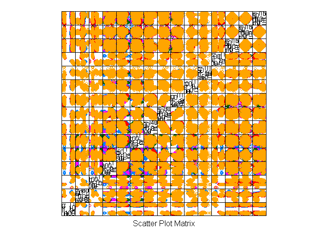

# machine learning : Peer Assessment

***

### overview and summary

We will analyze how well subjects perform a particular weight-lifting exercise by analysing data from accelerometers on the belt, forearm, arm, and dumbell of 6 participants.

The data consists of 160 measurements.

To model a predictor, I took into consideration the following :

- The exercise was the biceps curl, so I tried to focus the measurements on both relative position of belt/forearm/arm/dumbbell as well as relative acceleration of same.

- I generated a number of subsets of measurements with caret's featurePlot(), and attempted to select measurements that generated the most separation in the outcome variable ('classe' - a factor variable indicating how well the subject performed the exercise) as possible.

- A random forest training was selected, as it is good for modeling multi-value factor variables and categorization.

- For cross-validation, a 10-fold (with 3 repeats) was chosen.

- Model accuracy obtained : 94%

- Expected out of sample error : 6%


***

### dataset analysis


```
## Warning: package 'caret' was built under R version 3.2.5
```

```
## Loading required package: lattice
```

```
## Loading required package: ggplot2
```

```
## [1] "1 : X"
## [1] "3 : raw_timestamp_part_1"
## [1] "4 : raw_timestamp_part_2"
## [1] "7 : num_window"
## [1] "8 : roll_belt"
## [1] "9 : pitch_belt"
## [1] "10 : yaw_belt"
## [1] "11 : total_accel_belt"
## [1] "37 : gyros_belt_x"
## [1] "38 : gyros_belt_y"
## [1] "39 : gyros_belt_z"
## [1] "40 : accel_belt_x"
## [1] "41 : accel_belt_y"
## [1] "42 : accel_belt_z"
## [1] "43 : magnet_belt_x"
## [1] "44 : magnet_belt_y"
## [1] "45 : magnet_belt_z"
## [1] "46 : roll_arm"
## [1] "47 : pitch_arm"
## [1] "48 : yaw_arm"
## [1] "49 : total_accel_arm"
## [1] "60 : gyros_arm_x"
## [1] "61 : gyros_arm_y"
## [1] "62 : gyros_arm_z"
## [1] "63 : accel_arm_x"
## [1] "64 : accel_arm_y"
## [1] "65 : accel_arm_z"
## [1] "66 : magnet_arm_x"
## [1] "67 : magnet_arm_y"
## [1] "68 : magnet_arm_z"
## [1] "84 : roll_dumbbell"
## [1] "85 : pitch_dumbbell"
## [1] "86 : yaw_dumbbell"
## [1] "102 : total_accel_dumbbell"
## [1] "113 : gyros_dumbbell_x"
## [1] "114 : gyros_dumbbell_y"
## [1] "115 : gyros_dumbbell_z"
## [1] "116 : accel_dumbbell_x"
## [1] "117 : accel_dumbbell_y"
## [1] "118 : accel_dumbbell_z"
## [1] "119 : magnet_dumbbell_x"
## [1] "120 : magnet_dumbbell_y"
## [1] "121 : magnet_dumbbell_z"
## [1] "122 : roll_forearm"
## [1] "123 : pitch_forearm"
## [1] "124 : yaw_forearm"
## [1] "140 : total_accel_forearm"
## [1] "151 : gyros_forearm_x"
## [1] "152 : gyros_forearm_y"
## [1] "153 : gyros_forearm_z"
## [1] "154 : accel_forearm_x"
## [1] "155 : accel_forearm_y"
## [1] "156 : accel_forearm_z"
## [1] "157 : magnet_forearm_x"
## [1] "158 : magnet_forearm_y"
## [1] "159 : magnet_forearm_z"
## [1] "160 : problem_id"
```


```r
set.seed(1234)
train <- read.csv(file='pml-training.csv',na.strings=c('#DIV/0!', '', 'NA'),stringsAsFactors=FALSE,colClasses = myColClasses )
train[, c(1:52)] <- sapply(train[, c(1:52)], as.numeric)
train$classe = factor(train$classe)

dim(train)
```

```
## [1] 19622    53
```

```r
featurePlot(x=train[,
  c(
   "roll_belt",
   "pitch_belt",
   "yaw_belt",
   "roll_arm",
   "pitch_arm",
   "yaw_arm",
   "accel_arm_x",
   "accel_arm_y",
   "accel_arm_z",
   "accel_belt_x",
   "accel_belt_y",
   "accel_belt_z",
   "roll_dumbbell",
   "pitch_dumbbell",
   "yaw_dumbbell"
  )],
  y = train$classe,
  plot="pairs")
```

<!-- -->

```r
train_control <- trainControl(method="repeatedcv", number=10, repeats=3)
rfpml <- train(I(factor(classe))~
               roll_belt+
               pitch_belt+
               yaw_belt+
               roll_arm+
               pitch_arm+
               yaw_arm+
               accel_arm_x+
               accel_arm_y+
               accel_arm_z+
               accel_belt_x+
               accel_belt_y+
               accel_belt_z+
               roll_dumbbell+
               pitch_dumbbell+
               yaw_dumbbell,
  data=train[sample(nrow(train),5000),],     
  trControl=train_control, method="rf")
```

```
## Loading required package: randomForest
```

```
## Warning: package 'randomForest' was built under R version 3.2.5
```

```
## randomForest 4.6-12
```

```
## Type rfNews() to see new features/changes/bug fixes.
```

```
## 
## Attaching package: 'randomForest'
```

```
## The following object is masked from 'package:ggplot2':
## 
##     margin
```

```r
print(rfpml)
```

```
## Random Forest 
## 
## 5000 samples
##   15 predictor
##    5 classes: 'A', 'B', 'C', 'D', 'E' 
## 
## No pre-processing
## Resampling: Cross-Validated (10 fold, repeated 3 times) 
## Summary of sample sizes: 4501, 4501, 4499, 4502, 4499, 4500, ... 
## Resampling results across tuning parameters:
## 
##   mtry  Accuracy   Kappa    
##    2    0.9470010  0.9329565
##    8    0.9439308  0.9290902
##   15    0.9323294  0.9144441
## 
## Accuracy was used to select the optimal model using  the largest value.
## The final value used for the model was mtry = 2.
```

```r
print(rfpml$finalModel)
```

```
## 
## Call:
##  randomForest(x = x, y = y, mtry = param$mtry) 
##                Type of random forest: classification
##                      Number of trees: 500
## No. of variables tried at each split: 2
## 
##         OOB estimate of  error rate: 5.24%
## Confusion matrix:
##      A   B   C   D   E class.error
## A 1364  20  13  22  10  0.04548635
## B   37 912  34   4   4  0.07971746
## C   13  25 798  12   0  0.05896226
## D   10   2  26 799   0  0.04540024
## E    3   8  12   7 865  0.03351955
```


